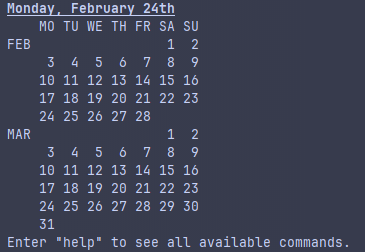

# 📅Javender 

### 1. Projektübersicht
- **Projektname**: Javender
- **Kurzbeschreibung**:  
  Javender ist eine Kalenderanwendung, die es Benutzern ermöglicht, Termine zu verwalten, Tags zu vergeben und anstehende Ereignisse einfach anzuzeigen. Das Tool hilft bei der Organisation des täglichen Lebens und bietet eine einfache textbasierte Benutzeroberfläche.
- ## 📅 Beispiel: Monatsübersicht

Hier ist ein Screenshot der Kalenderansicht:



### 2. Features
- Verwaltung von Terminen (Erstellen, Bearbeiten, Löschen).
- Tagging-System zur Kategorisierung von Terminen.
- Übersichtliche Monatsansicht mit farblicher Markierung von Terminen.
- Anzeige von bevorstehenden Terminen.
- Suchfunktion nach Terminen und Tags.
- Textbasierte Kommandoeingabe mit Befehlen wie `manage`, `upcoming` und Monatsnavigation.
- Integration mit SQLite-Datenbank zur persistenten Speicherung.
- Unterstützung von jOOQ für Datenbankinteraktionen.

### 3. Systemanforderungen
- **Java-Version**: Java 21 oder höher
- **Maven-Version**: 3.9.9
- **Datenbank**: SQLite (integriert über JDBC)
- **Empfohlene IDE**: IntelliJ IDEA, Eclipse oder VS Code

## 📥 Installation
### Direkte Installation
- Die .jar-Datei einfach von den Releases Laden und ausführen.
```bash
java -jar Javender-1.0-SNAPSHOT.jar 
```
- Achtung ⚠️: Das Programm erstellt in dem Ordner, in dem die .jar liegt bzw. wo sie ausgeführt wird einen Ordner namens "Data" und einen Namens "logs", in "Data" sind ihre Termine und Tags gespeichert, in logs sind die Logs gespeichert.
### Selber Bauen
- Das Projekt klonen
  - Achtung ⚠️: Überprüfen Sie die Java-Version und Maven-Version
```bash
git clone https://github.com/hwwastooshort/Javender.git
```
- In das Projektverzeichnis wechseln und das Projekt bauen
```bash
cd Javender
mvn clean install 
```
- Die entstandene .jar-Datei ausführen oder verschieben, wenn das gewünscht ist
```bash
java -jar target/Javender-1.0-SNAPSHOT.jar
```
- Achtung ⚠️: Auch hier gilt: Das Programm erstellt in dem Ordner, in dem die .jar liegt bzw. wo sie ausgeführt wird einen Ordner namens "Data" und einen Namens "logs", in "Data" sind ihre Termine und Tags gespeichert, in logs sind die Logs gespeichert.

## Schnellstart 🚀
```bash
java -jar Javender-1.0-SNAPSHOT.jar
```
- Sie sollten den jetzigen Monat und den Folgemonat sehen und mit `manage` können Sie Termine verwalten, mit `help` können sie die Befehle nachschlagen.

## Verwendung 🛠️
- Nach dem Starten des Programms können Sie Befehle eingeben, um Termine zu verwalten und anzuzeigen.
- Verfügbare Befehle:
  - `manage`: Verwalten Sie Termine (Erstellen, Bearbeiten, Löschen).
  - `now`: Zeigt den jetzigen Monat an
  - `<Name des Monats> (+ <Jahr>)`: Zeigt den gewünschten Monat an 
    - z.B. `janaury 2002` 
  - `upcoming (+ amount (+ tag name))`: Zeigt bevorstehende Termine an, auch nach Tags und Anzahl gefiltert.
    - z.B. `upcoming 5 work`

## ❗Bekannte Einschränkungen
- **Textbasierte Oberfläche**: Keine grafische Benutzeroberfläche vorhanden.
- **Fehler bei Datums-/Zeiteingaben**: Falsch formatierte Eingaben können zu Fehlern führen.
- **Keine Unterstützung für wiederkehrende Termine**: Z.B. wöchentliche Meetings sind nicht möglich.
- **Begrenzte Farbauswahl bei Tags**: Es stehen nur wenige Farben zur Verfügung.
- **Keine Erinnerungsfunktion**: Nutzer:innen werden nicht automatisch an Termine erinnert.
- **Eingeschränkte Suchfunktion**: Suche nach Terminen oder Tags ist begrenzt.
- **Keine Mehrbenutzer-Unterstützung**: Es gibt keine Möglichkeit, mehrere Benutzerprofile zu verwalten.
- **Keine Synchronisierung mit externen Kalendern**: Z.B. Google Kalender oder Outlook werden nicht unterstützt.
- **Keine Export-/Importfunktion**: Termine können nicht als CSV, iCal oder in andere Formate exportiert oder importiert werden.
- **Keine Zeitformat-Einstellungen**: Es wird ausschließlich das 24-Stunden-Format verwendet.