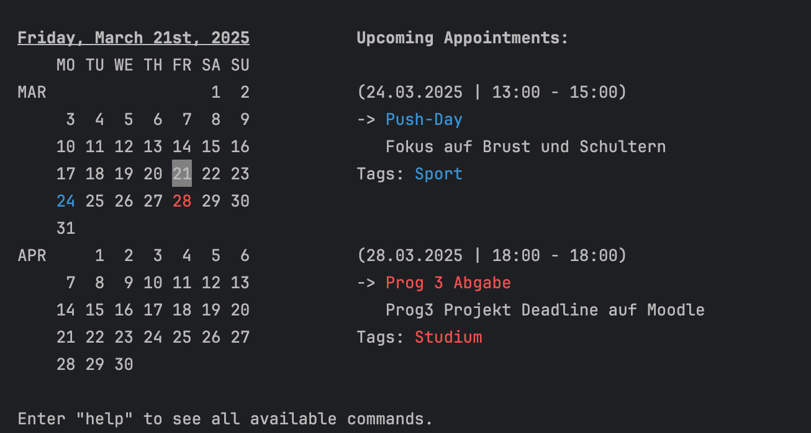

# 📅 Anleitung für den Schnelleinstieg – Javender

## 📌 Erfordernisse

### 1. Projektübersicht
- **Projektname**: Javender
- **Kurzbeschreibung**:  
  Javender ist eine Kalenderanwendung, die es Benutzern ermöglicht, Termine zu verwalten, Tags zu vergeben und anstehende Ereignisse einfach anzuzeigen. Das Tool hilft bei der Organisation des täglichen Lebens und bietet eine einfache textbasierte Benutzeroberfläche.
- ## 📅 Beispiel: Monatsübersicht

Hier ist ein Screenshot der Kalenderansicht:



### 2. Features
- Verwaltung von Terminen (Erstellen, Bearbeiten, Löschen).
- Tagging-System zur Kategorisierung von Terminen.
- Übersichtliche Monatsansicht mit farblicher Markierung von Terminen.
- Anzeige von bevorstehenden Terminen.
- Suchfunktion nach Terminen und Tags.
- Textbasierte Kommandoeingabe mit Befehlen wie `manage`, `upcoming` und Monatsnavigation.
- Integration mit SQLite-Datenbank zur persistenten Speicherung.
- Unterstützung von jOOQ für Datenbankinteraktionen.

### 3. Systemanforderungen
- **Java-Version**: Java 21 oder höher
- **Maven-Version**: Empfohlen zur Projektverwaltung und Build
- **Datenbank**: SQLite (integriert über JDBC)
- **Empfohlene IDE**: IntelliJ IDEA, Eclipse oder VS Code

## 📥 Installation

1. **Repository klonen:**

    1. #### Mit SSH (empfohlen, wenn ein SSH-Key eingerichtet ist):

    ```bash
    git clone git@github.com:hwwastooshort/Javender.git
    ```

   💡 **Hinweis:**  
   Falls noch kein SSH-Key eingerichtet wurde, folgen Sie der [GitHub-Dokumentation zur SSH-Konfiguration](https://docs.github.com/en/authentication/connecting-to-github-with-ssh).

    ---

    2. #### Mit HTTPS (einfach, keine SSH-Konfiguration erforderlich):

    ```bash
    git clone https://github.com/hwwastooshort/Javender.git
    ```

   💡 **Hinweis:**  
   Bei privaten Repositories wird nach den GitHub-Anmeldedaten oder einem **Personal Access Token (PAT)** gefragt.  
   [Mehr Informationen zum PAT](https://docs.github.com/en/authentication/keeping-your-account-and-data-secure/creating-a-personal-access-token)

    ---

   Wechseln Sie in das Projektverzeichnis:

    ```bash
    cd javender
    ```

2. **Abhängigkeiten installieren & Projekt bauen:**

    ```bash
    mvn clean install
    ```

3. **Datenbank vorbereiten:**  
   Stellen Sie sicher, dass sich die `javenderDatabase.db` im Verzeichnis `src/test/resources/` befindet.

4. **jOOQ Code generieren (optional, falls Schema geändert wurde):**

    ```bash
    mvn generate-sources
    ```


## 🚀 Schnellstart

1. **Anwendung starten**:
    ```bash
    java -jar target/Javender-1.0-SNAPSHOT.jar
    ```

2. **Erwartetes Verhalten**:
    - Nach dem Start wird die textbasierte Kalenderansicht angezeigt.
    - Die Eingabeaufforderung lädt zur Navigation oder Verwaltung ein.
    - Mit `help` wird eine Liste aller verfügbaren Befehle angezeigt.

## 📚 Anwendungsbeispiele

- **Monatsansicht anzeigen**:
    ```bash
    january 2025
    ```

- **Termin erstellen**:
    ```bash
    manage
    # Dann die Option „Add appointment“ wählen und Details eingeben.
    ```

- **Bevorstehende Termine anzeigen**:
    ```bash
    upcoming 3
    # Zeigt die nächsten 3 bevorstehenden Termine an.
    ```

- **Nach Tags filtern**:
    ```bash
    upcoming 5 meeting
    # Zeigt die nächsten 5 Termine mit dem Tag "meeting".
    ```

## ⚠️ Bekannte Einschränkungen
- **Textbasierte Oberfläche**: Keine grafische Benutzeroberfläche vorhanden.
- **Fehler bei Datums-/Zeiteingaben**: Falsch formatierte Eingaben können zu Fehlern führen.
- **Keine Unterstützung für wiederkehrende Termine** (z.B. wöchentliche Meetings).
- **Begrenzte Farbauswahl bei Tags**.
- **Keine Erinnerungsfunktion**: Nutzer:innen werden nicht automatisch an Termine erinnert.
- **Eingeschränkte Suchfunktion**: nach Terminen oder Tags.
- **Keine Mehrbenutzer-Unterstützung**: Es gibt keine Möglichkeit, mehrere Benutzerprofile zu verwalten.
- **Keine Synchronisierung mit externen Kalendern** (z.B. Google Kalender, Outlook).
- **Keine Export-/Importfunktion**: Termine können nicht als CSV, iCal oder andere Formate exportiert oder importiert werden.
- **Keine Zeitformat-Einstellungen**: Es wird ausschließlich das 24-Stunden-Format verwendet.
